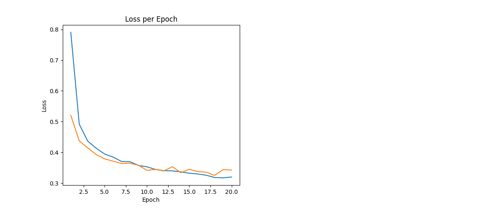
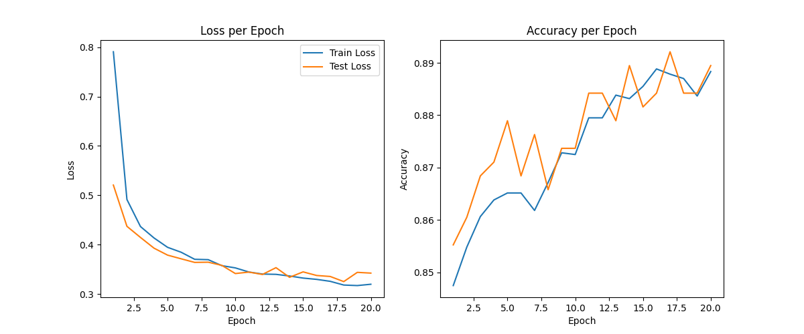

# AG News 텍스트 분류 보고서 with DistilBERT

본 과제는 AG News 데이터셋을 기반으로, 사전 학습된 DistilBERT 모델을 활용하여 뉴스 기사 분류 문제를 해결하는 것을 목표로 합니다. 주요 구현 내용은 다음과 같습니다.

---

## ✅ 구현 항목 체크리스트

- [x] AG_News dataset 준비
  - `fancyzhx/ag_news` Huggingface dataset 로드
  - `collate_fn` 함수 내 truncation 관련 코드 제거
- [x] Classifier 출력, 손실 함수, 정확도 함수 변경
  - `nn.CrossEntropyLoss` 사용
  - `TextClassifier` 출력 차원을 4로 수정
  - 정확도 계산 함수 수정 (`torch.argmax`)
- [x] 학습 결과 report
  - 각 epoch마다 train loss 출력
  - 최종 모델의 test accuracy report 포함

---

## 1. 데이터셋 준비 및 확인

```python
from datasets import load_dataset
import pandas as pd

train_ds = load_dataset("fancyzhx/ag_news", split="train[:5%]")
test_ds = load_dataset("fancyzhx/ag_news", split="test[:5%]")
pd.DataFrame(train_ds).head()
```

### ✅ 데이터 예시 출력

| index | text                                                                 | label |
|-------|----------------------------------------------------------------------|--------|
| 0     | Wall St. Bears Claw Back Into the Black (Reute... | 2      |
| 1     |  Carlyle Looks Toward Commercial Aerospace (Reu... | 2      |
| 2     |  Oil and Economy Cloud Stocks' Outlook (Reuters... | 2      |
| 3     |  Iraq Halts Oil Exports from Main Southern Pipe... | 2      |
| 4     |  Oil prices soar to all-time record, posing new... | 2      |
... ... ...
| 5995     |  Nobody is neutral about the great Google gambl... | 2      |
| 5996     |  Gloves are off as Abbey war turns dirty ANYONE... | 2      |
| 5997     |  Online hits climb the charts as radio embraces... | 3      |
| 5998     |  Epson develops worlds lightest flying robot Th... | 3      |
| 5999     |  Pieces of eight for Phelps How far do you have... | 1      |

6000 rows × 2 columns

```python
labels = pd.DataFrame(train_ds)['label']
labels.unique()  # [0, 1, 2, 3]
```

- **레이블 도메인**:
  - `0`: World
  - `1`: Sports
  - `2`: Business
  - `3`: Sci/Tech

---

## 2. 전처리 및 Tokenizer

- 모델: `distilbert-base-uncased`
- Tokenizer에서 `truncation`, `max_length` 제거
- `attention_mask` 포함하여 모델 입력 구성

```python
tokens = tokenizer(list(texts), padding=True, return_tensors="pt")
```

---

## 3. 모델 구조

- 사전 학습된 DistilBERT를 encoder로 사용
- `[CLS]` 토큰의 representation → `Linear(768, 4)` → softmax 분류
- encoder는 `freeze`, classifier만 학습

```python
self.encoder = DistilBertModel.from_pretrained("distilbert-base-uncased")
self.classifier = nn.Linear(768, 4)
```

---

## 4. 학습 설정

- 손실 함수: `nn.CrossEntropyLoss` (4-class 분류)
- Optimizer: `Adam`
- Epoch: 20
- Accuracy 계산은 `argmax` 기반 다중 클래스 방식

---

## 5. 학습 결과

```text
Epoch  1 | Train Loss: 0.7907 | Train Acc: 0.848 | Test Acc: 0.855
Epoch  2 | Train Loss: 0.4915 | Train Acc: 0.855 | Test Acc: 0.861
Epoch  3 | Train Loss: 0.4367 | Train Acc: 0.861 | Test Acc: 0.868
Epoch  4 | Train Loss: 0.4136 | Train Acc: 0.864 | Test Acc: 0.871
Epoch  5 | Train Loss: 0.3946 | Train Acc: 0.865 | Test Acc: 0.879
Epoch  6 | Train Loss: 0.3847 | Train Acc: 0.865 | Test Acc: 0.868
Epoch  7 | Train Loss: 0.3704 | Train Acc: 0.862 | Test Acc: 0.876
Epoch  8 | Train Loss: 0.3696 | Train Acc: 0.867 | Test Acc: 0.866
Epoch  9 | Train Loss: 0.3575 | Train Acc: 0.873 | Test Acc: 0.874
Epoch 10 | Train Loss: 0.3530 | Train Acc: 0.873 | Test Acc: 0.874
Epoch 11 | Train Loss: 0.3446 | Train Acc: 0.879 | Test Acc: 0.884
Epoch 12 | Train Loss: 0.3405 | Train Acc: 0.879 | Test Acc: 0.884
Epoch 13 | Train Loss: 0.3399 | Train Acc: 0.884 | Test Acc: 0.879
Epoch 14 | Train Loss: 0.3366 | Train Acc: 0.883 | Test Acc: 0.889
Epoch 15 | Train Loss: 0.3324 | Train Acc: 0.885 | Test Acc: 0.882
Epoch 16 | Train Loss: 0.3297 | Train Acc: 0.889 | Test Acc: 0.884
Epoch 17 | Train Loss: 0.3258 | Train Acc: 0.888 | Test Acc: 0.892
Epoch 18 | Train Loss: 0.3183 | Train Acc: 0.887 | Test Acc: 0.884
Epoch 19 | Train Loss: 0.3172 | Train Acc: 0.884 | Test Acc: 0.884
Epoch 20 | Train Loss: 0.3199 | Train Acc: 0.888 | Test Acc: 0.889
=========> Final Test acc: 0.889
```

---

## 6. 학습 결과 시각화

### 🔽 Loss Curve



### 🔽 Accuracy Plot



---

## 7. 실행 방법

```bash
pip install transformers datasets matplotlib
python run_classifier.py
```

또는 Jupyter/Colab 환경에서 셀을 순서대로 실행.

---

## 🔗 참고

- tokenizer는 문장을 자르지 않고 전체 입력 사용
- DistilBERT는 max length 512 기준으로 자동 처리
- tokenizer의 truncation 옵션은 **명시적으로 제거됨**

---

## 📌 GitHub 링크

[참고](https://github.com/eumcloud/AGNews-DistilBERT-Classifier)

---

## ✅ Summary

| 항목 | 적용 여부 | 설명 |
|------|-----------|------|
| **AG News 데이터셋** | ✅ | `fancyzhx/ag_news` 5%만 사용 |
| **Tokenizer** | ✅ | `DistilBertTokenizerFast` 사용, truncation 제거 |
| **Collate function** | ✅ | `attention_mask` 포함, `truncation` 없음 |
| **모델 구조** | ✅ | DistilBERT encoder + Linear(768, 4) |
| **손실 함수** | ✅ | `CrossEntropyLoss` 사용 |
| **정확도 함수** | ✅ | `torch.argmax`, 다중 클래스 대응 |
| **Epoch별 출력** | ✅ | Train Loss, Train Acc, Test Acc |
| **시각화 저장** | ✅ | `./img/loss_curve_ag.png`, `./img/accuracy_plot_ag.png` |

---
