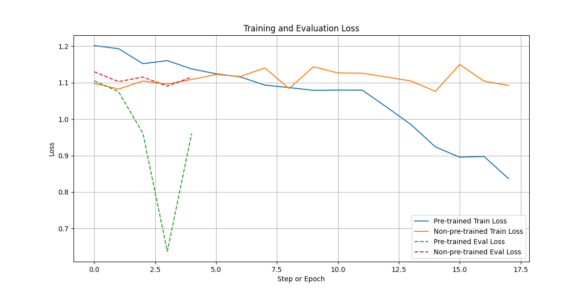
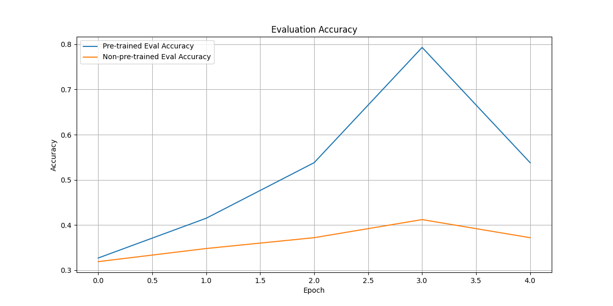

# Multi-Genre Natural Language Inference (MNLI) 케이스 모델 비교 보고서

## 1. 실험 개요

본 프로젝트는 **Multi-Genre Natural Language Inference (MNLI)** 태스크를 해결하기 위한 모델을 설계하고 학습시키는 실험을 수행.  
MNLI는 두 문장(Premise와 Hypothesis)의 논리적 관계를 다음 세 가지 범주 중 하나로 분류하는 문제입니다.

- **Entailment**: 전제가 가설을 논리적으로 포함할 때 = 0  
- **Neutral**: 전제와 가설이 논리적으로 무관할 때 = 1  
- **Contradiction**: 전제와 가설이 논리적으로 모순될 때 = 2  

해당 태스크를 통해 **Pre-trained BERT 모델을 fine-tuning하는 경우와**, **동일한 구조의 Non-pre-trained Transformer를 학습시킨 경우**의 성능 차이를 비교 분석하였다.

---

## 2. 데이터셋 및 전처리

### 2.1 데이터셋

- 출처: [Kaggle - Unlocking Language Understanding with the MultiNLI](https://www.kaggle.com/datasets/thedevastator/unlocking-language-understanding-with-the-multin)
- 사용 파일:
  - `train.csv` (학습용, 1,000 샘플)
  - `validation_matched.csv` (검증용, 1,000 샘플)

---

### 2.2 데이터 확인 예시

전처리 후의 데이터 일부는 다음과 같습니다.  
입력은 `premise`와 `hypothesis`의 문장 쌍이며, 라벨은 아래와 같이 3개 클래스로 구성되어 있습니다.

| premise                                                 | hypothesis                                                  | label |
|----------------------------------------------------------|--------------------------------------------------------------|--------|
| Conceptually cream skimming has two basic d...           | Product and geography are what make cream skim...           | 1      |
| You know during the season and I guess at at y...         | You lose the things to the following level if...            | 1      |
| One of our number will carry out your instruct...         | A member of my team will execute your orders w...           | 0      |
| How do you know? All this is their information.           | This information belongs to them.                           | 0      |
| yeah i tell you what though if you go price so...         | The tennis shoes have a range of prices.                    | 2      |

레이블 분포 확인 결과:

```python
np.unique([sample['label'] for sample in train_data])
# 출력: array([1, 0, 2])
```

### 2.2 입력 구조

- 입력: `(premise, hypothesis)` 형태의 두 문장 쌍
- 출력: `0 (entailment), 1 (neutral), 2 (contradiction)` 중 하나의 정수 레이블

### 2.3 전처리

- Huggingface의 `AutoTokenizer`를 사용하여 토크나이징 수행
- 최대 길이 128로 패딩 및 트렁케이션
- `transformers.Dataset`을 활용하여 모델에 바로 입력 가능한 형태로 변환

---

## 3. 모델 설계

### 3.1 Pre-trained 모델 (BERT-base-uncased)

- 구조: Huggingface `AutoModelForSequenceClassification`
- 설정:
  - `num_labels=3` 설정
  - 사전 학습된 `bert-base-uncased` weight 로드
- 입력: `{'input_ids': [B, L], 'attention_mask': [B, L]}`
- 출력: `[B, 3]` (softmax logits)

### 3.2 Non-pre-trained 모델

- 구조는 BERT와 동일하나, 사전 학습 weight 없이 랜덤 초기화된 상태로 학습 시작
- 동일한 `config`를 사용하여 구조적 차이는 없음

---

## 4. 학습 설정 및 실험 환경

- 프레임워크: PyTorch, Huggingface Transformers
- 학습기: `Trainer` API 사용
- 하이퍼파라미터:
  - Epochs: 3
  - Batch size: 16 (train), 64 (eval)
  - Optimizer: AdamW
  - Weight decay: 0.01
  - Evaluation: 매 epoch마다 수행
- Loss: CrossEntropyLoss
- Metric: Accuracy, F1

---

## 5. 실험 결과

### 5.1 정량적 비교

| 모델                    | Train Acc | Test Acc | Gen. Gap | Best Val Acc |
|-------------------------|-----------|----------|----------|---------------|
| Pre-trained BERT        | 0.7930    | **0.5380** | **-0.2550** | **0.5380** |
| Non-pre-trained BERT    | 0.4120    | 0.3720   | -0.0400   | 0.3720        |

- Pre-trained 모델은 학습 정확도는 높지만 테스트 정확도는 낮은 편 → 과적합 경향  
- Non-pretrained 모델은 상대적으로 안정적인 일반화(gap이 작음)이나 전체 성능은 낮음

---

### 5.2 시각화 결과

#### (1) Loss Curve

- 학습 도중 Pre-trained 모델은 빠르게 수렴하며 loss가 안정적으로 감소함
- Non-pre-trained 모델은 전반적으로 수렴 속도가 느리고 변동이 크며, 높은 loss 유지



#### (2) Accuracy Plot

- Pre-trained 모델의 정확도는 epoch마다 증가하며 최종적으로 0.538
- Non-pre-trained 모델은 완만하게 증가하며 0.372에 도달



---

## 6. 분석 및 결론

이번 실험을 통해 Pre-trained BERT 모델이 갖는 다음과 같은 장점이 명확히 드러났다.

- **Pre-training의 효과**:
  - 사전 학습된 모델은 이미 언어적 구조와 의미를 학습하고 있어 적은 데이터로도 빠르게 수렴
  - 정확도가 빠르게 향상되며, 상대적으로 낮은 loss를 달성함

- **Non-pre-trained 모델의 한계**:
  - 학습 초기 단계에서 성능 향상이 느리며, 일반화 성능이 낮음
  - 사전지식 없이 weight를 처음부터 학습해야 하므로 시간과 데이터 소모가 큼

결론적으로, MNLI와 같은 텍스트 분류 태스크에서 사전 학습 언어모델을 활용하는 것이 성능 향상과 효율성 측면에서 매우 효과적이다.

---

## 7. 프로젝트 파일 구성

```

.
├── week03/
│   └── plot/
│       ├── loss_curve.png        # Loss 시각화
│       └── accuracy_plot.png     # Accuracy 시각화
|   ├── requirements.txt              # 설치 의존성 목록
|   └── README.md                     # 본 보고서
|    ├── mnli_finetune.ipynb           # MNLI 실험 notebook

```

## 📌 GitHub 링크

[참고](https://github.com/eumcloud/HHPLUS_AI/blob/main/week03/mnli_finetune.ipynb)

---

## 8. 실행 방법

```bash
# 필수 라이브러리 설치
pip install -r requirements.txt

# 또는 Jupyter Notebook 실행
jupyter notebook mnli_finetune.ipynb
```
